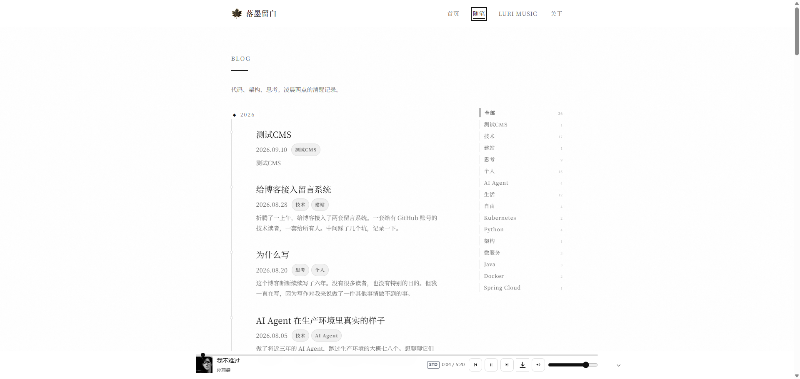
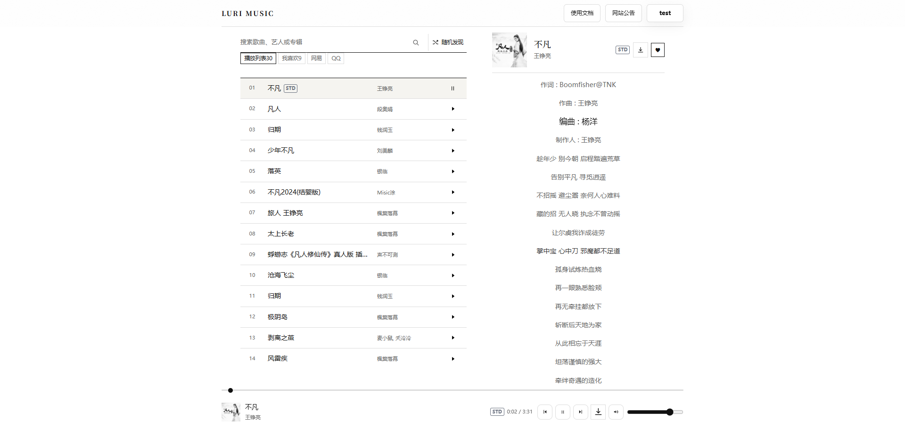
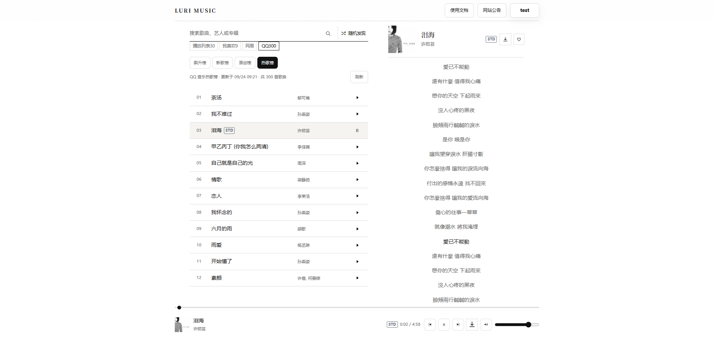
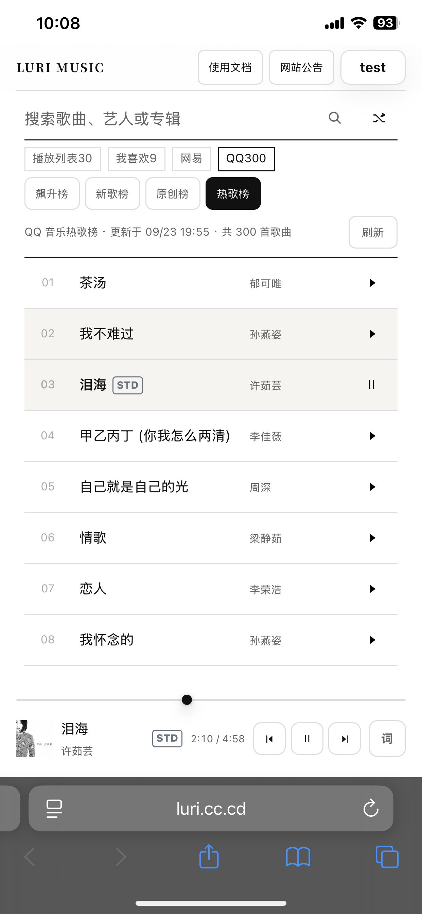
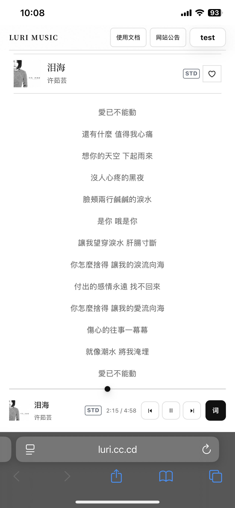

<div align="center">
  
  <h1>LURI</h1>
  <p>个人博客与独立音乐播放器客户端</p>
  <p>
    <a href="https://luri.cc.cd">在线预览</a> · 
    <a href="#-快速开始">快速开始</a> · 
    <a href="#-部署">部署指南</a> · 
    <a href="/docs">开发文档</a>
  </p>
</div>

## ✨ 特性

- 🎵 **独立音乐播放器**：支持第三方 Music Provider 协议，可自由接入音乐源
- 📝 **Markdown 博客**：支持标签分类、文章摘要、评论系统
- 🎨 **现代化设计**：响应式布局，支持桌面端和移动端
- 🔐 **账号系统**：用户注册、登录、Provider 配置管理
- 🎧 **媒体控制**：支持耳机线控、蓝牙设备、系统媒体中心
- ⚡ **高性能**：基于 Vite 构建，Cloudflare Workers 部署
- 🛠️ **管理后台**：可视化管理用户、网站设置、邮件配置

## 📸 预览

### 博客首页
<div align="center">
  
</div>

### LURI MUSIC 播放器
<div align="center">
  
  <p><em>桌面端 - 播放界面</em></p>
</div>

<div align="center">
  
  <p><em>桌面端 - 音乐榜单</em></p>
</div>

### 移动端体验
<div align="center">
  
  
  <p><em>移动端 - 播放列表与歌词页面</em></p>
</div>

## 🏗️ 技术栈

**前端**
- React 19 + React Router 6
- Vite 8
- 原生 CSS（无预处理器依赖）
- React Markdown + remark-gfm

**后端**
- Cloudflare Workers（Serverless API）
- Cloudflare D1（SQLite 数据库）
- Workers Static Assets（静态资源托管）

**集成**
- Waline / Giscus 评论系统
- Resend 邮件服务
- Cloudflare Turnstile 验证

## 📦 项目组成

| 模块 | 路由 | 说明 |
| --- | --- | --- |
| 首页 | `/` | 个人主页与博客入口 |
| 随笔 | `/blog` | Markdown 文章列表、标签筛选与文章详情 |
| 关于 | `/about` | 个人介绍，可在后台隐藏 |
| LURI MUSIC | `/music` | 支持第三方 Music Provider 的音乐播放器客户端 |
| 开发者文档 | `/docs` | Provider 使用说明、协议与接口文档 |
| 管理后台 | `/admin` | 用户、管理员、网站设置和邮件配置 |

LURI MUSIC 与博客共用同一个前端应用，但访问策略相互独立。后台可以隐藏博客导航中的 MUSIC 入口，同时保留 `/music` 的直接访问能力；也可以彻底停用音乐页面，或切换成仅显示音乐页面的模式。

## 🎯 架构边界

**本仓库包含：**

- 个人博客页面与 Markdown 文章构建流程
- LURI MUSIC 播放器界面、账号和访问权限
- 用户 Provider 配置、加密存储和通用 Provider 协议客户端
- Cloudflare Worker API、D1 数据库迁移和管理后台

**本仓库不包含：**

具体音乐平台适配、音源搜索实现、媒体地址解析或音频代理。搜索、随机发现、播放资源、歌词和封面等能力由用户配置的独立 Provider 按协议提供。浏览器直接请求当前激活的 Provider，博客 Worker 不转发音频数据。

📖 协议说明位于网站 [`/docs`](https://luri.cc.cd/docs) 页面和 [`docs/music-provider-protocol`](docs/music-provider-protocol)  
🚀 部署说明见 [`docs/luri-music.md`](docs/luri-music.md) 与 [`docs/cloudflare-music.md`](docs/cloudflare-music.md)

## 🚀 快速开始

### 环境要求

- Node.js 20 或更高版本
- npm 或 yarn
- Cloudflare 账号（用于部署）

### 本地开发

```bash
# 克隆仓库
git clone https://github.com/mobaiit/luri-blog.git
cd luri-blog

# 安装依赖
npm install

# 启动开发服务器（仅前端）
npm run dev

# 联调完整应用（前端 + Worker API + D1）
npm run build
npx wrangler dev
```

### 常用命令

```bash
npm run lint      # 代码检查
npm run build     # 构建生产版本
npm run preview   # 预览生产构建
```

## ⚙️ 配置

### 数据库设置

创建 Cloudflare D1 数据库并更新 `wrangler.toml`：

```bash
# 创建数据库
npx wrangler d1 create LURI_MUSIC_DB

# 执行迁移
npx wrangler d1 migrations apply LURI_MUSIC_DB --remote
```

### 环境变量

通过 Wrangler Secret 配置敏感信息：

| 变量 | 说明 | 必需 |
| --- | --- | --- |
| `PROVIDER_CREDENTIAL_KEY` | 加密用户保存的 Provider 凭证 | ✅ |
| `TURNSTILE_SITE_KEY` | Turnstile 前端站点密钥 | 可选 |
| `TURNSTILE_SECRET_KEY` | Turnstile 服务端校验密钥 | 可选 |
| `RESEND_API_KEY` | 邮件发送服务密钥 | 可选 |

```bash
npx wrangler secret put PROVIDER_CREDENTIAL_KEY
npx wrangler secret put TURNSTILE_SECRET_KEY
npx wrangler secret put RESEND_API_KEY
```

### 网站显示设置

进入 `/admin` 的"网站设置"可以分别控制：

- ✅ 是否启用个人博客站点
- ✅ 是否启用随笔页面及导航
- ✅ 是否启用关于我页面及导航
- ✅ 是否在博客导航显示 MUSIC
- ✅ 是否启用 LURI MUSIC 站点
- ✅ 是否在音乐页显示博客一级导航
- ✅ 是否显示 Provider 开发者文档
- ✅ 音乐功能是否需要登录和有效访问权限

## 📝 文章管理

文章位于 `src/posts/`，文件名格式：`YYYY-MM-DD-slug.md`

### Front Matter 示例

```yaml
---
title: 文章标题
date: 2026-09-21
tags: [开发, 随笔]
excerpt: 文章摘要
---

文章内容使用 Markdown 格式...
```

Vite 插件 `plugins/vite-plugin-posts.js` 会在构建时自动解析文章，并生成列表和详情页面。

## 📤 部署

### 部署到 Cloudflare

```bash
# 构建项目
npm run build

# 部署到 Cloudflare Workers
npx wrangler deploy
```

### 部署前检查清单

- ✅ `wrangler.toml` 中 D1 database ID 正确
- ✅ 所有数据库迁移已执行
- ✅ Worker Secrets 已配置
- ✅ `dist/` 已由最新代码构建

## 📁 目录结构

```text
luri-blog/
├── docs/                     # 部署说明与 Provider 协议文档
├── functions/luri-music/     # 账号、后台与 Provider 配置 API
├── migrations/               # Cloudflare D1 数据库迁移
├── plugins/                  # Vite Markdown 文章插件
├── public/                   # 公共静态资源
├── src/
│   ├── components/           # 博客通用组件
│   ├── luri-music/          # LURI MUSIC 与管理后台界面
│   ├── pages/               # 博客、播放器和文档页面
│   └── posts/               # Markdown 文章
├── worker.js                 # Cloudflare Worker 入口与路由控制
└── wrangler.toml            # Cloudflare 部署配置
```

## 📄 License

本项目采用 [CC BY-NC-SA 4.0](https://creativecommons.org/licenses/by-nc-sa/4.0/) 协议开源。

**简单来说：**
- ✅ 个人使用、学习、研究：完全免费
- ✅ 修改和分发：允许，但需要署名
- ✅ 衍生作品：必须使用相同协议
- ❌ 商业使用：需要单独授权

**商业授权：**  
如需将本项目用于商业目的，请联系作者获取授权：luri@luri.cc.cd

**免责声明：**  
LURI MUSIC 播放器不托管、不存储、不缓存、不代理任何音频文件。所有音乐内容由用户自行配置的第三方 Provider 提供。使用本项目时，请遵守相关法律法规和第三方服务的使用条款。

---

<div align="center">
  <p>Made with ❤️ by <a href="https://luri.cc.cd">LURI</a></p>
  <p>
    <a href="https://github.com/mobaiit/luri-blog/issues">报告问题</a> · 
    <a href="https://github.com/mobaiit/luri-blog/pulls">提交 PR</a>
  </p>
</div>
